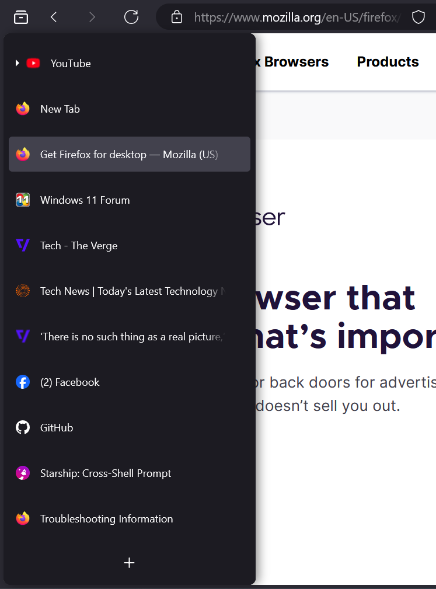

# Firefox Plus (Tested on Windows only)

# Rounded Corners

# Sidebar Support

 

# How to install
1. Go to `about:support` and click the "Open Folder/Show in Finder" button for the root directory of your browser profile/s.
2. Download and copy the `chrome` folder and `user.js` into the profile folder.
3. Restart firefox.

# Tweaks
- To enable macOS button style, open `user.js` and find `fp.tweak.macos-button` and set it to `true`.  
- To disable bookmarks autohide open `user.js` and find `fp.tweak.autohide-bookmarks` and set it to `false`.
- To enable or disable rounded corners, open `user.js` and find `fp.tweak.rounded-corners` and set it to `true` or `false`.  
- To enable support for sidebar open `user.js` and find `fp.tweak.sidebar-enabled` and set it to `true` or `false`.  

> [!NOTE]
> To get sidebar support you will need to install extension [Sidebar Tabs](https://github.com/asamuzaK/sidebarTabs)

Enjoy your enhanced browsing experience!

## Star History

[]
