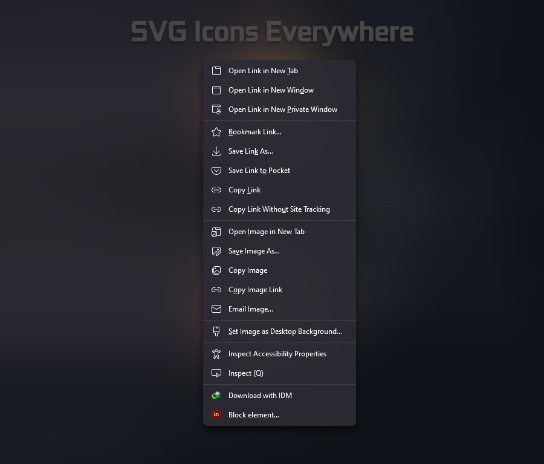
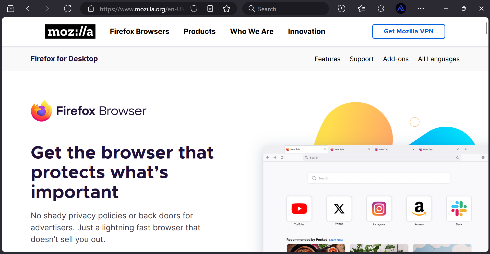
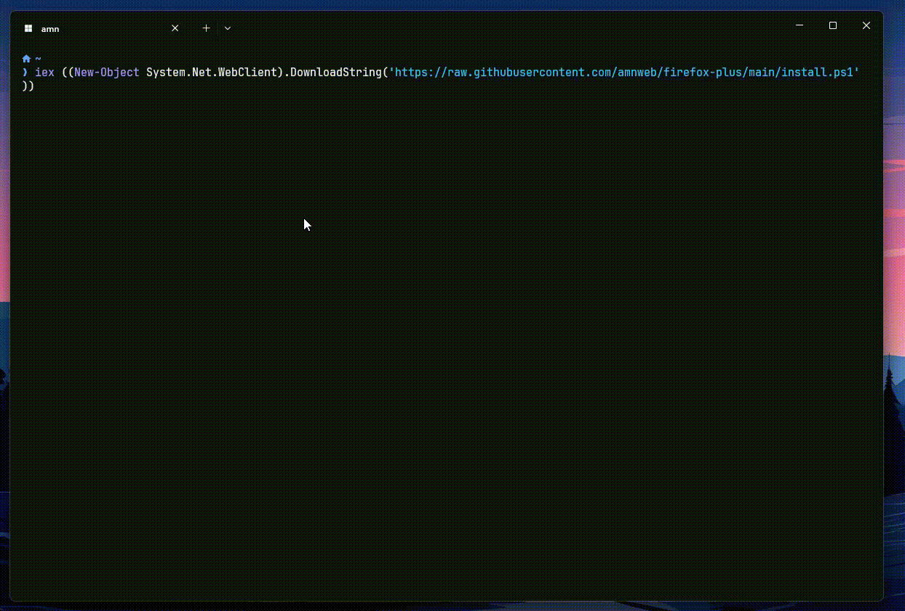

# Firefox Plus (Windows only)




# Rounded Corners



# How to install
1. Go to `about:support` and click the "Open Folder/Show in Finder" button for the root directory of your browser profile/s.
2. Download and copy the `chrome` folder and `user.js` into the profile folder.
3. Restart Firefox.

> **Note:** FireFox v135+ only

# Tweaks
- To enable macOS button style, open `user.js`, find `fp.tweak.macos-button` and set it to `true`.  
- To disable bookmarks autohide open `user.js`, find `fp.tweak.autohide-bookmarks` and set it to `false`.
- To enable or disable rounded corners, open `user.js`, find `fp.tweak.rounded-corners` and set it to `true` or `false`.  
- To enable or disable White Mode, open `user.js`, find `browser.in-content.dark-mode` and set it to `true` or `false`. Then find and set `ui.systemUsesDarkTheme` to `1` or `0`.


# Install or update Firefox Plus directly from PowerShell.

1. Open PowerShell.
2. Copy and paste this command

```
iex ((New-Object System.Net.WebClient).DownloadString('https://raw.githubusercontent.com/amnweb/firefox-plus/main/install.ps1'))
```



***Enjoy your enhanced browsing experience!***

## Star History


# License

This project is licensed under the MIT License.